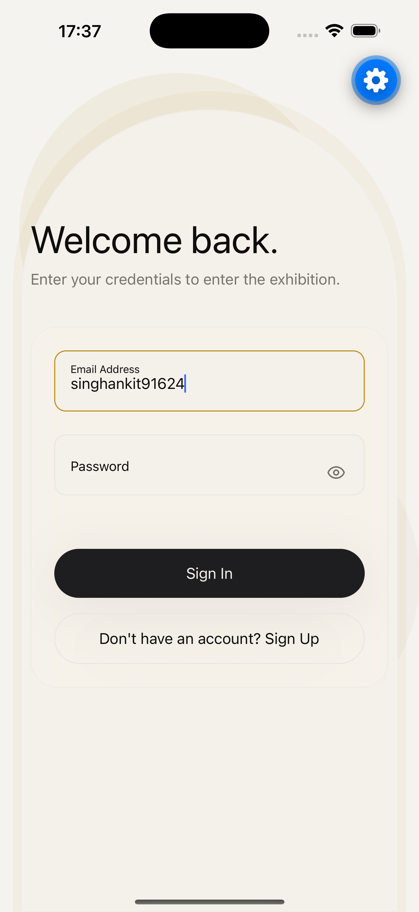

<div align="center">

# 🏛️ ATELIER

### *React Native Gallery Experience*
*Production-grade React Native application built using modern mobile architecture.*

[](https://expo.dev)
[](https://reactnative.dev)
[](https://www.typescriptlang.org)
[](https://docs.swmansion.com/react-native-reanimated/)
[](LICENSE)

<br />



<br />

</div>

---

## 📖 Overview

**ATELIER** is a high-performance, museum-inspired image gallery application engineered with **React Native**, **Expo SDK 57**, and a **5-Layer Feature-First Architecture**. Drawing inspiration from Apple Vision Pro spatial UI, Nothing OS minimalism, and Arc Browser fluid motion, ATELIER delivers a quiet luxury experience featuring 60 FPS UI thread animations, hardware-accelerated glassmorphism, dynamic theme reactive palettes, and strict compliance with official endpoints.

---

## ✨ Features

- **🔒 Authentication:** Token-based patron authentication with form validation (`React Hook Form` + `Zod`) and persistent session hydration via `AsyncStorage`.
- **🖼️ Gallery Feed:** High-resolution virtualized gallery stream consuming strictly `https://picsum.photos/v2/list?page=1&limit=30` with progressive image placeholders.
- **🔍 Search:** Real-time client-side search filtering by artist name and image ID without additional API roundtrips.
- **🏷️ Filter:** Categorical filtering chips (A-M / N-Z) for browsing masterworks by author index.
- **📜 Pagination:** Virtualized infinite-like smooth viewport pagination with memory-disk image caching.
- **❤️ Favorites:** Curated personal salon for acquiring artworks with optimistic UI updates and background storage persistence.
- **👤 Patron Profile:** Interactive curator profile management featuring Indian city & location autocomplete (`OpenStreetMap Nominatim`).
- **🎨 Theme Engine:** Reactive lighting mode switcher supporting System, Light, and Dark themes with HSL token mapping.
- **🔎 Image Viewer:** Full-screen modal viewer with double-tap zoom, pinch-to-zoom, pan gestures, and swipe-to-dismiss.
- **📥 Download:** Direct high-resolution image downloading to device media library via `expo-file-system` and `expo-media-library`.
- **📤 Share:** Native cross-platform artwork sharing via `expo-sharing`.
- **💾 Storage Persistence:** Robust storage repository layer abstracting local key-value storage.
- **♿ Accessibility:** Full support for system-level Reduced Motion, screen reader labels (`accessibilityLabel`), and touch target sizing.
- **🎬 Fluid Animations:** 60 FPS UI thread spatial depth parallax scrolling worklets powered by `React Native Reanimated 4`.

---

## 🛠️ Tech Stack

| Technology | Purpose | Version |
| :--- | :--- | :--- |
| **React Native** | Cross-Platform Mobile UI Engine | `0.86.2` |
| **Expo** | Application Framework & Native SDK | `~57.0.10` |
| **TypeScript** | Static Type Safety & Interfaces | `^5.3.3` |
| **React Navigation** | Native Stack & Floating Bottom Tab Navigation | `^6.11.0` |
| **TanStack Query** | Server State Management & Caching | `^5.101.4` |
| **Zustand** | Global Client State Management | `^5.0.14` |
| **AsyncStorage** | Local Key-Value Persistence | `^2.1.2` |
| **React Hook Form** | Form State & Validation Management | `^7.51.0` |
| **Zod** | Schema Validation Engine | `^3.22.4` |
| **Reanimated** | High-Performance Worklet Animations | `4.5.1` |
| **Gesture Handler** | Native Touch Gesture Recognizers | `~2.24.0` |
| **Expo Image** | Hardware-Accelerated Image Caching | `~2.0.7` |
| **Expo File System** | Local File System I/O | `~18.0.12` |
| **Expo Sharing** | Native Share Sheet Controller | `~13.0.1` |
| **Expo Media Library** | Camera Roll & Media Access | `~17.0.1` |

---

## 🏛️ Architecture

ATELIER adopts a **5-Layer Feature-First Architecture** designed for scalability, separation of concerns, and maintainability:

```text
src/
├── core/                # Layer 1: Core Utilities, Storage & Theme Tokens
│   ├── api/             # HTTP Client Setup & Axios Adapters
│   ├── error/           # React Error Boundaries
│   ├── hooks/           # Debounce & Shared Hooks
│   ├── storage/         # AsyncStorage Repository Wrapper
│   └── theme/           # Design Tokens, Color Palettes & ThemeStore
├── design/              # Layer 2: Reusable UI Component System
│   └── components/      # Typography, GlassCard, TextField, LocationAutocomplete
├── experience/          # Layer 3: Spatial Parallax, Lighting & Micro-Interactions
│   ├── interactions/    # Press Feedback & Motion Springs
│   ├── parallax/        # 3D Depth & Viewport Spatial Interpolation
│   └── scene/           # Ambient Lighting Blobs & Glass Overlays
├── features/            # Layer 4: Domain Modules (Auth, Gallery, Favorites, Profile)
│   ├── auth/            # Auth Controllers, Services & Stores
│   ├── favorites/       # Curated Salon State & Components
│   ├── gallery/         # Picsum Service, Controllers & Search
│   └── profile/         # Profile Modal & Location Integration
└── navigation/          # Layer 5: Presentation Navigation & Floating Dock
    └── components/      # Floating Glass Navigation Dock
```

---

## 📁 Directory Structure

```text
ATELIER/
├── assets/
│   ├── icon.png
│   ├── splash.png
│   └── readme/
│       └── login.png
├── docs/
│   ├── assignment-mapping.md
│   └── release-report.md
├── src/
│   ├── core/
│   ├── design/
│   ├── experience/
│   ├── features/
│   └── navigation/
├── app.json
├── babel.config.js
├── eas.json
├── metro.config.js
├── package.json
├── tsconfig.json
└── README.md
```

---

## 🧠 State Management

1. **Zustand (`Global Client State`):** Lightweight, unopinionated client state management powering `useAuthStore`, `useFavoritesStore`, `useThemeStore`, and `useToastStore`.
2. **TanStack Query (`Server State & Caching`):** Asynchronous state management handling gallery fetching from Picsum API with 5-minute stale-time caching, automatic refetching, and error state handling.
3. **Storage Repository (`Persistence Layer`):** Abstracted `storage` module wrapping `AsyncStorage` for seamless JSON serialization and async error handling.

---

## 💎 Design Philosophy

- **Quiet Luxury:** Minimalist typography, subtle borders, and intentional whitespace inspired by high-end museum catalogs.
- **Apple Vision Pro Spatial UI:** Layered z-index depth, ambient glowing backdrop lighting blobs, and floating frosted glass capsules.
- **Museum Experience:** High-contrast artwork presentations with rich dark and warm ivory theme variations.
- **Glassmorphism:** Real-time hardware-accelerated backdrop blur (`expo-blur`) with subtle border highlights.
- **3D Spatial Motion:** Viewport-relative parallax translation worklets on scroll (`Reanimated 4`).
- **Accessibility First:** High contrast ratios, accessible touch targets (44px+), and full reduced motion compliance.

---

## 🚀 Installation & Local Development

### Prerequisites
- Node.js `v22.x` or higher
- npm `v10.x` or higher
- Expo Go app on mobile device or Xcode/Android Studio simulator

### Steps

```bash
# 1. Clone repository
git clone https://github.com/singhankit001/ATELIER.git
cd ATELIER

# 2. Install dependencies
npm install

# 3. Verify TypeScript type safety
npx tsc --noEmit

# 4. Verify Expo project health
npx expo-doctor

# 5. Start Metro development server
npx expo start -c
```

---

## 📦 Build Instructions

### Android Build (APK & AAB)

```bash
# Install EAS CLI globally if needed
npm install -g eas-cli

# Login to Expo Application Services
eas login

# Generate Standalone Android APK (Preview Profile)
eas build --platform android --profile preview

# Generate Google Play Store Bundle (Production AAB)
eas build --platform android --profile production
```

### iOS Build (IPA)

> **Note:** Building an iOS `.ipa` binary requires an active **Apple Developer Program** account for code signing and provisioning profiles.

```bash
# Generate Production iOS App Bundle (.ipa)
eas build --platform ios --profile production
```

---

## ⚡ Performance Optimizations

- **Virtualized Lists:** Optimized `FlatList` configuration with `removeClippedSubviews={true}`, `initialNumToRender={4}`, `maxToRenderPerBatch={4}`, and `windowSize={5}`.
- **Memoization:** Component-level `React.memo` with custom comparison functions on `GalleryItem` and `FavoriteItem` to eliminate unnecessary re-renders.
- **Optimistic UI Updates:** Instant UI toggle in `useFavoritesStore` prior to background persistence.
- **UI Thread Worklets:** All parallax translations, scale transforms, and gesture tracking run purely on the native UI thread via Reanimated worklets.
- **Hardware-Accelerated Caching:** `expo-image` memory-disk caching with progressive blurred placeholders.

---

## ♿ Accessibility

- **Reduced Motion:** Automatic fallback for all Reanimated spring and timing animations when `useReducedMotion()` is active.
- **Screen Reader Support:** Explicit `accessibilityRole`, `accessibilityLabel`, and `accessibilityState` attributes on all buttons, inputs, and tab items.
- **Touch Target Compliance:** Minimum 44px x 44px hit slop on interactive controls.
- **Semantic HTML & Roles:** Accessible image buttons, text fields, and tab bars.

---

## 🔮 Future Improvements

- [ ] **Offline Exhibition Mode:** Pre-cache full high-resolution artwork bundles for offline offline viewing.
- [ ] **Custom Curator Collections:** User-created thematic playlists (e.g., "Modernism", "Landscapes").
- [ ] **Augmented Reality View:** Place artworks on room walls using ARKit / ARCore integration.

---

## 📜 License

Distributed under the **MIT License**. See `LICENSE` for details.
