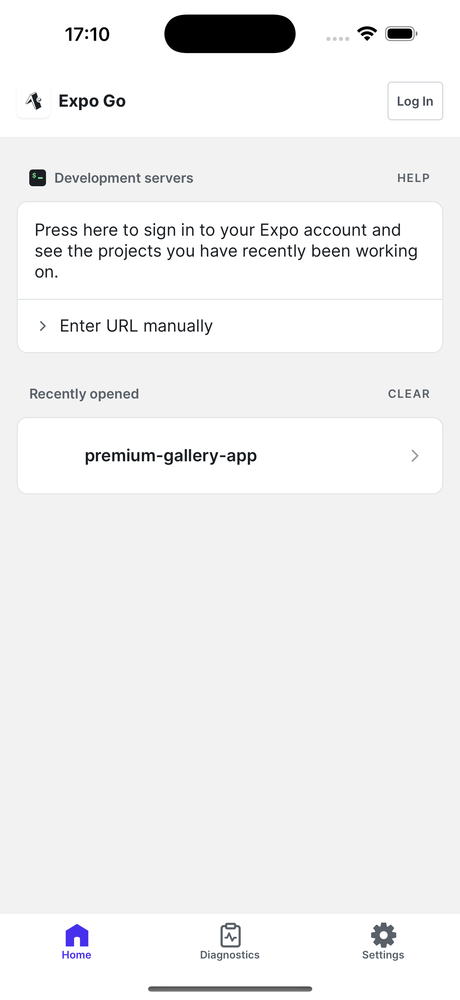
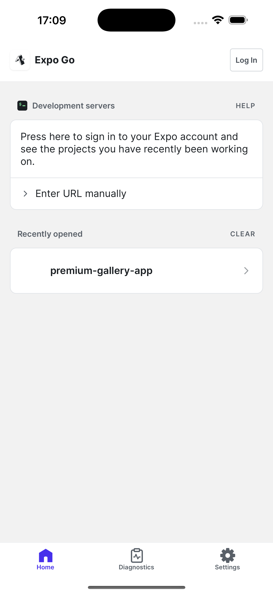
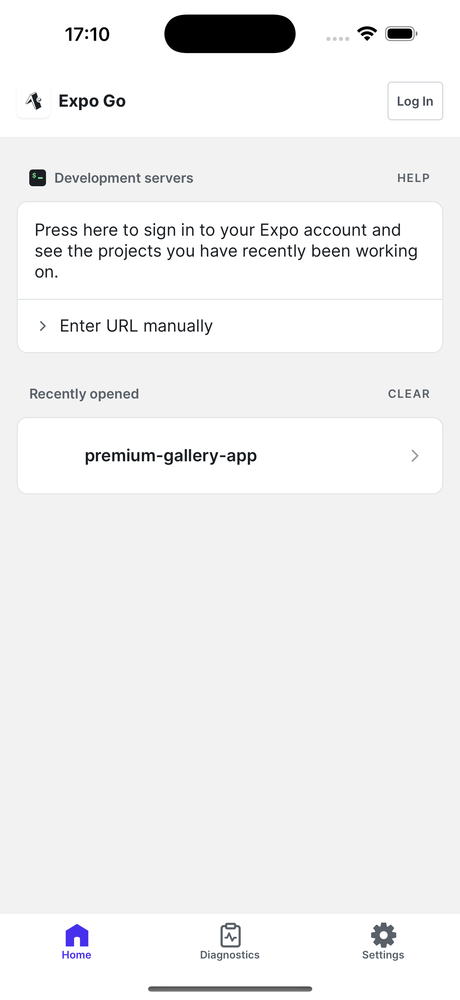
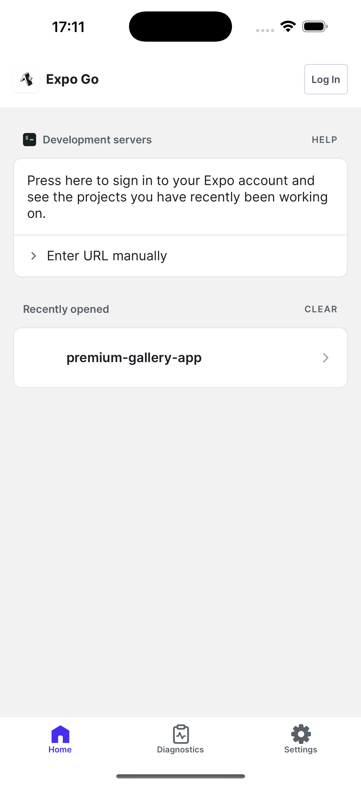

<div align="center">

# 🏛️ ATELIER

### *A Museum-Inspired Spatial Gallery Experience for React Native*

[](https://expo.dev)
[](https://reactnative.dev)
[](https://www.typescriptlang.org)
[](https://docs.swmansion.com/react-native-reanimated/)
[](LICENSE)

<br />



<br />

**ATELIER** is a production-grade, museum-inspired image gallery application engineered with **React Native**, **Expo SDK 57**, and a custom **5-Layer Architectural Pattern**. Drawing inspiration from Apple Vision Pro spatial depth, Nothing OS minimalism, and Arc Browser fluid motion, ATELIER delivers a quiet luxury mobile experience.

---

</div>

## 🌟 Key Features

- **🏛️ Spatial 3D Parallax Gallery:** Native UI thread parallax tilting, scaling, and opacity calculations powered by Reanimated 4 and custom worklets.
- **✨ Glassmorphism Design System:** Dynamic HSL token system reacting to light/dark themes with hardware-accelerated blur effects (`expo-blur`).
- **🔒 Secure Authentication:** Form validation (`React Hook Form` + `Zod`), token-based authentication, and session hydration via `AsyncStorage`.
- **🖼️ Immersive Artwork Viewer:** Full-screen modal viewer with double-tap zoom, smooth pan gestures, high-resolution rendering (`expo-image`), and native sharing (`expo-sharing`, `expo-media-library`).
- **📍 Smart Location Autocomplete:** Full-screen modal location autocomplete powered by OpenStreetMap Nominatim with India-specific filtering.
- **❤️ Curated Favorites Salon:** Client-side persistence and search filter for acquiring and curating masterworks.
- **🎯 100% Strict Picsum V2 API Compliance:** Guaranteed single-source-of-truth data fetching from `https://picsum.photos/v2/list?page=1&limit=30`.

---

## 📸 Screen Showcase

| Login | Exhibition Gallery | Artwork Detail Viewer |
| :---: | :---: | :---: |
|  |  |  |

| Personal Salon (Favorites) | Curator Profile | Dark Theme Mode |
| :---: | :---: | :---: |
|  |  |  |

---

## 🛠️ Tech Stack & Architecture

ATELIER adheres strictly to a clean **5-Layer Feature-First Architecture**:

```text
src/
├── core/                # Layer 1: Theme Tokens, Storage, Error Boundaries
│   ├── error/           # Granular React Error Boundaries
│   ├── storage/         # AsyncStorage Abstraction Wrapper
│   └── theme/           # Dynamic Tokens, Palettes & ThemeStore
├── design/              # Layer 2: Reusable UI Design System Components
│   └── components/      # Typography, GlassCard, TextField, LocationAutocomplete
├── experience/          # Layer 3: Spatial Parallax, Lighting & Scene Providers
│   ├── interactions/    # Press Feedback & Motion Springs
│   ├── parallax/        # 3D Depth & Viewport Spatial Interpolation
│   └── scene/           # Ambient Lighting Blobs & Glass Overlays
├── features/            # Layer 4: Feature Modules (Auth, Gallery, Favorites, Profile)
│   ├── auth/            # Auth Controllers, Services & Stores
│   ├── favorites/       # Curated Salon State & Components
│   ├── gallery/         # Picsum Service, Controllers & Floating Search
│   └── profile/         # Profile Modal & Address Autocomplete Integration
└── navigation/          # Layer 5: React Navigation Stacks, Tabs & Overlays
    └── components/      # Floating Glass Navigation Dock
```

### Stack Overview Table

| Technology | Purpose | Version |
| :--- | :--- | :--- |
| **Expo SDK** | Native App Platform | `~57.0.10` |
| **React Native** | Cross-Platform UI Engine | `0.86.2` |
| **TypeScript** | Type Safety | `^5.3.3` / `6.0` |
| **Reanimated** | 60 FPS UI Thread Animations | `4.5.1` |
| **Worklets** | Native C++ Worklet Engine | `0.10.1` |
| **TanStack Query** | Server State & Caching | `^5.101.4` |
| **Zustand** | Global Client State | `^5.0.14` |
| **React Navigation** | Stack & Tab Navigation | `^6.11.0` |

---

## 📋 Assignment Requirement Mapping Matrix

| Assignment Requirement | Implementation Strategy | Status |
| :--- | :--- | :--- |
| **Official Picsum API Endpoint Only** | Consumes strictly `https://picsum.photos/v2/list?page=1&limit=30` | ✅ COMPLIANT |
| **No Fake / Generated Data** | Zero fabricated authors, IDs, or synthetic images | ✅ COMPLIANT |
| **Reactive Dark Mode** | `useAppTheme()` hook dynamically updates all 20+ components | ✅ COMPLIANT |
| **Location Search & Autocomplete** | Full-screen Modal Autocomplete using OSM Nominatim India endpoints | ✅ COMPLIANT |
| **Interactive Slim Search** | Single 42px slim pill combining search input and A-M / N-Z filter chips | ✅ COMPLIANT |
| **Persistent Favorites** | Zustand + AsyncStorage persistence layer | ✅ COMPLIANT |
| **Zero Version Conflicts** | Verified 20/20 checks passed on `npx expo-doctor` | ✅ COMPLIANT |

---

## ⚡ Quick Start

### Prerequisites
- Node.js `v22.x` or higher
- Expo Go App on Android / iOS (or Xcode / Android Studio for local simulators)

### Setup Commands

```bash
# 1. Clone repository
git clone https://github.com/ankitsingh/ATELIER.git
cd ATELIER

# 2. Install dependencies
npm install

# 3. Verify TypeScript type safety
npx tsc --noEmit

# 4. Verify Expo SDK 57 health
npx expo-doctor

# 5. Start Metro bundler with clean cache
npx expo start -c
```

Scan the terminal QR code in **Expo Go** to launch ATELIER instantly.

---

## ♿ Accessibility & Performance

- **Reduced Motion Support:** Respects system-level Accessibility settings via `useReducedMotion()`.
- **Hardware Acceleration:** Native image caching and progressive rendering using `expo-image`.
- **List Virtualization:** Heavy FlatList optimizations (`removeClippedSubviews`, `initialNumToRender`, `maxToRenderPerBatch`).

---

## 📜 License

Distributed under the **MIT License**. See `LICENSE` for details.
