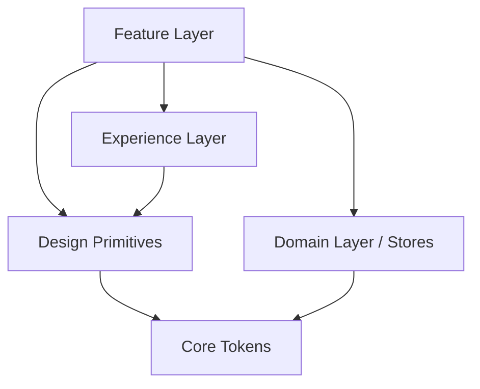

# Architecture & The 5-Layer System

## Overview
This application follows a strict 5-layer separation of concerns. This design philosophy isolates business logic from rendering, rendering from motion, and motion from primitives. It ensures that as the application grows, components do not devolve into entangled monoliths.

## The 5 Layers

### 1. Core Layer (`src/core`)
**Purpose**: Handles infrastructure, theme tokens, and global configuration.
**Why**: UI components shouldn't directly contain hex codes, and network requests shouldn't reinvent error handling. The Core layer abstracts these foundational pieces so the rest of the app can rely on a stable, normalized API.

### 2. Domain Layer (`src/domain` encapsulated inside `features/`)
**Purpose**: Manages global state, business logic, and entity definitions.
**Why**: State engines (Zustand) and Data-fetching engines (TanStack Query) should have no concept of React Native Views or layout. This allows the business logic to be tested purely in a Node environment without mocking React UI components.

### 3. Experience Layer (`src/experience`)
**Purpose**: Manages physics, spatial transitions, and haptic feedback.
**Why**: Complex Reanimated interpolations and Gesture Handler logic quickly bloat functional components. The Experience Layer abstracts these interactions into hooks (`usePressEffect`, `useSpatialTransition`) so features remain declarative.

### 4. Design Layer (`src/design`)
**Purpose**: Translates Core tokens into strictly-typed UI primitives.
**Why**: Prevents UI inconsistencies. Developers cannot create a random "blue button." They must use the `<Button>` component which derives its colors directly from the Core Theme Engine.

### 5. Feature Layer (`src/features`)
**Purpose**: Combines Domain data, Experience motion, and Design primitives into screen layouts.
**Why**: Screens should be thin assemblers of logic rather than heavy orchestrators. A `GalleryScreen` simply connects the `useGalleryStore` to the `<GalleryItem>` UI.

## Application Architecture Flow

